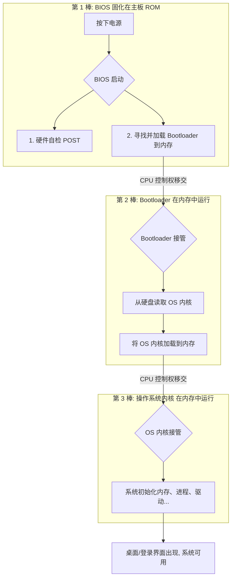

‍

## 0. 两点说明

说明：  
1.每一种操作系统的启动细节都不一样，  
但是，不同的操作系统的大体启动流程都是差不多的。  
2.真实的操作系统的启动流程非常的复杂，需要很多的前置知识的  
只对一般操作系统的大体的启动流程做个简单的讲解

1. **不同 OS 启动细节不同**  
    例如 Linux 与 Windows 的实现差异很大，但**宏观流程**基本一致：上电 → 固件初始化/自检 → Bootloader → 加载 OS → OS 初始化。
2. **真实流程很复杂**  
    本节只给出“大体流程”的直觉图景。等后续学完前置知识，再深入讲解（如 Linux 启动链路的细节）。

---

## 1. 预备知识与概念澄清

- **操作系统（OS）本质是程序/软件**  
  启动前它​**存放在磁盘**（例如 Windows 在 C 盘）。
- **Bootloader（引导加载程序）**   
  一个小程序，负责把磁盘里的 OS ​**装入内存**，让 CPU 能去执行。
- **BIOS（基本输入输出系统）**   
  固定在主板上的程序，位于主板的 **ROM（Read-Only Memory，只读存储器）**  区。

  - 课堂中对比：我们常说的“内存”一般指 **RAM（随机访问存储器，可读可写）** 。
- 
- **主引导扇区（MBR）与 512 字节**  
  为方便 BIOS 快速定位引导代码，传统 Bootloader 的首段常放在​**磁盘第一个主引导扇区**（大小 512B）。
- **CPU 的程序计数器（PC）**   
  指向**下一条**要执行的指令所在的内存地址。只有把代码装进​**内存**，CPU 才能“取指—译码—执行”。

---

‍

‍

## 2. 总览：通用启动流程一图懂

```
[上电] 
   ↓
[主板/BIOS(ROM)]
   ├─ 自检（POST：显卡/键鼠/磁盘等）
   └─ 加载 Bootloader → 放入内存
         ↓
[Bootloader(内存中执行)]
   └─ 从磁盘读取 OS 内核与必要数据 → 装入内存
         ↓
[切换到 OS 首条指令]
   └─ OS 初始化（内存/进程/驱动/文件系统...）
         ↓
[系统可用]（用户态应用可被创建与运行）
```

## 3. 分步详解

### 第一步：上电与 BIOS 介入

- **上电**后，主板供电稳定，CPU 开始执行指令。
- **CPU 执行的第一条指令**来自主板 ROM 中的 BIOS 区域（PC 指向该地址）。
- **BIOS 的两件大事：**

  1. ​**自检（POST）** ：检查显卡、键盘、鼠标、磁盘等是否工作正常。
  2. **寻找并加载 Bootloader** 到内存：  
      为简化定位，Bootloader 的首段通常放在​**磁盘第一个主引导扇区（512B）** 。

> 小贴士：这一步有时也叫“固件阶段”。现代电脑常见 **UEFI** 固件（本课用 BIOS 词汇，概念上相当于“上电后第一个运行的固件程序”）。


### 第二步：Bootloader 接管

- BIOS 把 Bootloader 放入内存后，**PC 指向 Bootloader 的首条指令**，CPU 开始执行 Bootloader。
- 
- **Bootloader 的核心职责：**

  - 读取磁盘上的 ​**OS 程序与相关数据**；
  - 把它们**加载到内存**合适的位置；
  - 准备好必要的启动参数/环境；
  - 最后把 ​**PC 切到 OS 的入口**（首条指令）。

> 课堂强调：**只有装进内存**，CPU 才能执行。Bootloader 是“搬运+切换”的关键桥梁。
>
> 

### 第三步：切到操作系统并初始化

- Bootloader 完成加载后，将 ​**PC 指向 OS 的第一条指令**。
- **OS 开始运行，进行初始化：**

  - 建立内存管理（分页/页表等）
  - 初始化中断/陷入、进程/线程管理
  - 加载必要驱动、挂载文件系统
  - 创建**用户态应用**的运行环境
- 初始化完成后，系统进入可用状态（你看到的登录界面、桌面、终端等）。

---

## 4. 课堂要点回顾（高频考点/易错点）

- ​**操作系统不是一上电就“在内存”** ​：它先在磁盘里，需要**Bootloader**搬到内存后，CPU 才能执行。
- ​**BIOS 在 ROM，OS/Bootloader 在磁盘**：BIOS 上电即用；OS/Bootloader 需被加载到 RAM。
- ​**PC（程序计数器）指向当前执行位置**：  
  上电 → 指向 BIOS；  
  BIOS 结束 → 指向 Bootloader；  
  Bootloader 结束 → 指向 OS。
- **512B 主引导扇区**是传统布局知识点，不必死记其内部结构，但要知道“便于固件快速定位引导代码”。

---

## 5. 小对比：不同系统为何“细节不同但流程相似”？

- ​**差异处**：分区格式、引导协议、内核文件布局、驱动装载方式、图形化/文本化引导界面、UEFI/BIOS 方式等。
- ​**共性骨架**：  
  固件初始化 → 找到引导代码 → 把 OS 装到内存 → 把 CPU 执行权交给 OS → OS 初始化。

---

## 6. 课堂问答（FAQ）

**Q1：为什么必须先加载到内存再执行？**   
A：CPU 只能从**内存**取指令执行。磁盘是外设，访问慢且不能被 CPU 直接当作指令存储读取来执行。

**Q2：BIOS 与 OS 的关系？**   
A：BIOS 是上电后最先运行的固件程序，完成自检与引导，把 OS 拉到内存并把控制权交给 OS。之后 OS 接管系统资源管理。

**Q3：Bootloader 一定只有 512B 吗？**   
A：传统 MBR 的**首段**是 512B，用于放置最小引导代码。实际 Bootloader 往往分阶段（stage1/stage2），后续阶段可以更大更复杂。

---

‍

‍

‍

‍

### 从按下电源到桌面亮起：揭秘操作系统启动过程

---

#### 1. 预备知识：启动前的“演员”们

在启动大戏上演之前，我们先来认识几位关键的“演员”：

- **操作系统 (OS)** ：它本质上是一个**大型软件程序**。在关机状态下，它静静地躺在你的**硬盘**里（例如 Windows 的 C 盘）。
- **内存 (RAM)** ：随机访问存储器，可读可写。CPU 只能执行**加载到内存中**的程序指令。它就像一个 **“临时工作台”** ，断电后数据会全部丢失。
- **BIOS (基本输入输出系统)** ：固化在主板**只读存储器 (ROM)**  上的一小段程序。它就像计算机的 **“本能”** ，一上电就知道该做什么。断电后数据不会丢失。
- **引导加载程序 (Bootloader)** ：一个专门负责 **“搬运”** 工作的小程序。它的任务就是去硬盘里找到操作系统，然后把它**加载到内存**这个“工作台”上。


有了这些基本概念，我们就可以开始这场启动之旅了。

---

#### 2. 启动总览：一场三步走的“接力赛”

整个启动过程，可以看作是一场由 BIOS、Bootloader 和操作系统内核参与的“三棒接力赛”。



---

#### 3. 分步详解：接力赛的每一个精彩瞬间

##### 第一步：BIOS 的“晨间唤醒”

当你按下电源按钮，电流涌入主板，CPU 立刻苏醒，并根据固定的地址，开始执行主板 ROM 里的 **BIOS** 程序。BIOS 的工作有条不紊：

1. **硬件自检 (POST - Power-On Self-Test)** ：BIOS 会快速检查一遍关键硬件，如显卡、内存、键盘、鼠标、硬盘等，确保它们都处于正常工作状态。如果硬件有问题，你可能会听到几声报警蜂鸣。
2. **寻找引导设备并加载 Bootloader**：自检通过后，BIOS 会按照预设的启动顺序（例如 U 盘 > 硬盘）去查找可引导的设备。它会读取设备的第一个扇区（传统上称为**主引导记录 MBR**，大小为 512 字节），并将找到的 **Bootloader** 程序加载到内存中的一个约定好的位置。


完成这两项任务后，BIOS 就把“接力棒”交给了 Bootloader。

> **小贴士**：现代计算机大多使用 **UEFI** 固件替代了传统的 BIOS，它更强大、启动更快。但从宏观流程上看，它们扮演的角色是相同的——**完成硬件初始化并启动 Bootloader**。

##### 第二步：Bootloader 的“搬运使命”

现在，CPU 的控制权已经转移到了刚刚被加载到内存中的 **Bootloader** 手上。Bootloader 是一个专一的“搬运工”，它的核心使命就是：

1. **定位操作系统内核**：它知道操作系统文件（如 Linux 的 `vmlinuz`）存放在硬盘的哪个位置。
2. **加载到内存**：将内核文件以及一些必要的初始化数据从硬盘读取出来， **“搬运”** 到内存中。
3. **移交控制权**：完成搬运后，Bootloader 会跳转到操作系统内核在内存中的入口地址，并将 CPU 的控制权彻底交给操作系统。


至此，Bootloader 的使命完成，光荣退场。

##### 第三步：操作系统内核的“最后一棒”

接力赛的最后一棒，也是最关键的一棒，现在交到了**操作系统内核**手中。从这一刻起，操作系统真正开始运行，并进行一系列复杂的**初始化**工作：

- **建立内存管理**：初始化页表，开启虚拟内存机制。
- **加载驱动程序**：识别并初始化各种硬件的驱动。
- **挂载文件系统**：将硬盘分区挂载到目录树上，让文件可以被访问。
- **启动核心进程**：创建系统的第一个用户进程（如 Linux 的 `systemd`​ 或 `init`），由它来启动其他所有系统服务和用户界面。

当所有初始化工作完成后，你熟悉的登录界面或桌面就出现了，整个系统进入了可用状态。

---

#### 4. 核心要点回顾

- **启动顺序**：操作系统不是凭空启动的，它依赖于一个**固件(BIOS/UEFI) → Bootloader → OS 内核**的链式加载过程。
- **内存是关键**：任何程序（包括 OS 本身）都必须先被**加载到内存 (RAM)**  中，CPU 才能执行它。
- **位置关系**：BIOS 固化在**主板 ROM** 中，而 OS 和 Bootloader 通常存储在**硬盘**上。
- **控制权转移**：整个启动过程伴随着 CPU 控制权的有序转移：**BIOS → Bootloader → OS 内核**。

现在，当你再次按下电源按钮时，你脑海中浮现的，应该不再是单调的等待，而是一场精彩纷呈的系统启动“接力赛”！
