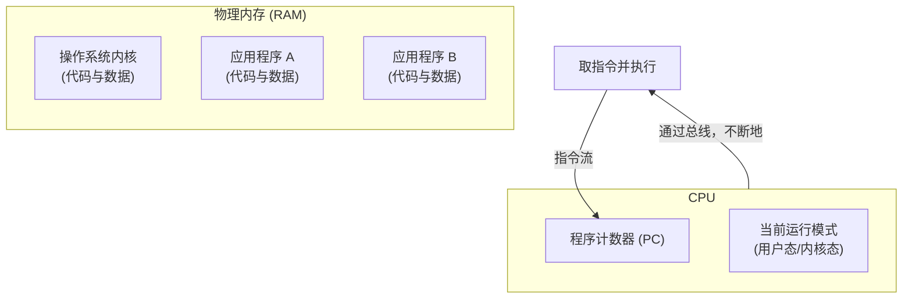
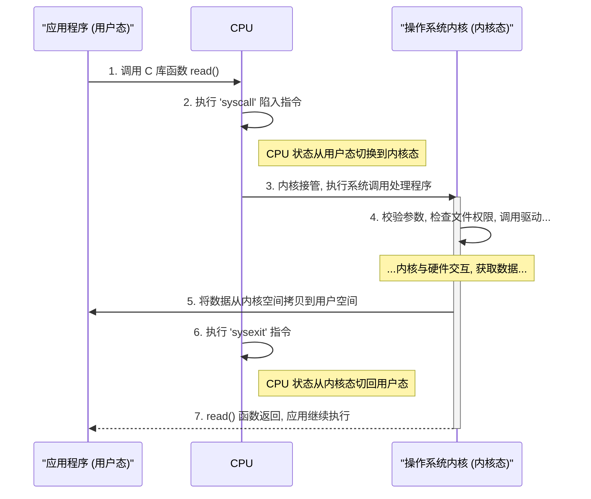

### 为何要有“用户态”与“内核态”？

在我们与计算机的日常交互中，应用程序似乎拥有无尽的“魔力”：它可以播放音乐（操作声卡）、可以上网冲浪（操作网卡）、还可以读写文件（操作磁盘）。但事实上，这些应用程序自身并没有直接接触硬件的“超能力”。

它们的所有特权行为，都必须通过一个“神圣”的中间人——**操作系统内核**。而区分应用程序和内核权限边界的机制，就是我们今天要探讨的核心概念：**用户态 (User Mode)**  与 **内核态 (Kernel Mode)** 。

---

#### 1. 两种运行模式：CPU 的“双重人格”

从 CPU 的视角来看，它在执行程序时拥有两种不同的“人格”或状态，这两种状态决定了它能执行的指令集范围：

- **用户态 (User Mode)** ：  
  这是应用程序运行时 CPU 所处的状态。在这个状态下，CPU 的权限受到严格限制，像一个“普通员工”，只能执行一部分无害的计算和逻辑指令（如 `mov`​, `add`​, `sub`​, `push`​, `pop`​），**不能执行那些能直接操控硬件的指令**。
- **内核态 (Kernel Mode)** ：  
  这是操作系统内核运行时 CPU 所处的状态。在这个状态下，CPU 拥有至高无上的权力，像一个“系统管理员”，可以执行机器能够运行的**任何指令**，包括那些能够直接操控硬件的**特权指令**（如 `in`​, `out` 等）。

---

#### 2. 为什么要区分用户态与内核态？—— 为了安全与秩序

想象一个没有这种区分的世界：任何一个应用程序，哪怕是一个小小的计算器，都可以随心所欲地向硬盘发送写指令，或者清空整个内存。这会带来灾难性的后果：

- **安全崩溃**：恶意程序可以轻松窃取其他程序的数据，甚至破坏整个操作系统。
- **资源冲突**：两个程序可能同时抢占同一个打印机端口，导致打印内容混乱不堪。
- **系统不稳定**：一个有 Bug 的程序可能会无意中关闭 CPU 中断，导致整个系统卡死。

因此，区分用户态和内核态，就是为了在硬件层面建立起一道**保护屏障**，确保系统的**安全、隔离与稳定**。

---

#### 3. CPU、内存与操作系统的“三角关系”

要理解用户态和内核态的切换，必须先明确一个物理事实：**无论是操作系统内核，还是应用程序，它们的指令和数据都存放在内存中**。

**图解**：

- CPU 的**程序计数器 (PC)**  指向内存中下一条要执行的指令地址。
-  **当 PC 指向** ​** **应用程序** **​ **的内存区域时，CPU 处于** ​** **用户态** **​ **。** 
-  **当 PC 指向** ​** **操作系统内核** **​ **的内存区域时，CPU 切换到** ​** **内核态** **​ **。** 
- 所谓的“状态切换”，本质上就是 CPU 执行流程在**应用程序代码**和**内核代码**之间的跳转，并伴随着权限等级的改变。

---

#### 4. 内核如何与硬件对话：两种主流方式

既然只有内核能触碰硬件，那它具体是怎么做的呢？主要有两种方式：

##### 4.1 方式一：I/O 指令 (端口 I/O)

这是一种比较传统的方式。硬件设备的控制器上有很多**端口（Port）** ，每个端口对应一个功能。内核通过专门的、**特权的 I/O 指令**来读写这些端口，从而控制硬件。

- **典型指令**：`in`​ (从端口读), `out` (向端口写)。
- **特点**：这些指令是为 I/O 操作专门设计的，地址空间与内存地址空间是隔离的。

##### 4.2 方式二：内存映射 I/O (MMIO) 与中断

这是现代操作系统更常用、更高效的方式。系统会将硬件设备的**控制寄存器**映射到一块特定的**物理内存地址**上。这样，内核就可以像读写普通内存一样，通过 `mov` 等指令来读写这些“特殊的内存地址”，从而操作硬件。

- **特点**：无需专门的 I/O 指令，但这些内存区域受到内存管理单元（MMU）的保护，只有内核有权访问。
- **配合中断**：当设备完成任务（如网卡收到数据包）时，会向 CPU 发送一个**中断信号**。CPU 收到信号后，会立即暂停当前任务，切换到内核态，并执行该设备对应的**中断服务程序（ISR）** ，完成后续处理。这种**异步**机制避免了 CPU 的忙等，效率极高。

---

#### 5. 从用户态到内核态的“穿越”：系统调用之旅

应用程序如何从受限的用户态，“穿越”到拥有特权的内核态来完成任务呢？这个过程就是**系统调用 (System Call)** 。

让我们以“读取文件”为例，看看这个抽象的流程：

**图解**：系统调用是应用程序获取操作系统服务的**唯一、合法**的桥梁。任何试图绕过它直接执行特权指令的行为，都会被 CPU 硬件立即捕获，并触发异常，导致应用程序被操作系统终止。

---

#### 6. 常见误区澄清

- **误区 1**：用户态“不能访问内存”。

  - **纠正**：错。用户态当然能访问**属于自己的用户空间内存**；但不能随意访问**内核空间内存**或其他进程的内存。
- **误区 2**：应用程序能“直接”操作磁盘/网卡。

  - **纠正**：错。必须通过**系统调用**，由内核委托驱动程序来完成，这是一个受控的间接过程。
- **误区 3**：中断只与“异常”（如除零错误）相关。

  - **纠正**：不完全对。设备完成任务后触发的中断，是**正常 I/O 工作流程**的关键部分，是高效的异步通信机制。

---

#### 7. 思考与延伸

- **思考 1**：为什么系统调用要用专门的“陷入”指令，而不是像普通函数那样直接调用内核代码？（提示：权限切换）

1. **权限无法跨越**：普通函数调用 (`call`​) 只是一个程序内的跳转，CPU 的运行模式（用户态）不会改变。而操作系统内核的代码和数据位于受硬件保护的**内核空间**，用户态程序没有权限直接访问，如果强行调用会触发硬件异常，导致进程崩溃。
2. **需要受控切换**：系统调用需要一个原子性的、由硬件保证的**状态切换**过程。专门的“陷入”指令（如 `syscall`​）能完成这个任务：它会**保存用户现场、将 CPU 从用户态切换到内核态、并跳转到操作系统预设好的唯一入口点**。

**一句话总结：普通函数调用无法突破硬件设定的权限壁垒，只有“陷入”指令才能提供一个从用户态到内核态的、唯一的、安全的入口。**

- **思考 2**：异步 I/O 与中断有什么关系？为什么说应用程序自己进行轮询是一种低效的方式？

  - **关系**：**中断是实现高效异步 I/O 的硬件基础**。

    - **异步 I/O** 的核心是“发起请求后立即返回，不等待结果”。
    - **中断** 则是“当 I/O 操作完成后，硬件主动通知 CPU”的机制。

    这两者结合，使得 CPU 在发起 I/O 请求后，可以立即去处理其他任务，不必原地等待。当 I/O 完成时，硬件会通过**中断**“回调”操作系统，操作系统再来处理后续事宜。

    **为什么轮询低效**：

    轮询是指应用程序在一个循环里不断地去问“数据好了吗？”。这种方式会让 CPU 在 I/O 等待期间**100% 空转**，执行着无意义的查询，这被称为 **“忙等 (Busy-Waiting)”** 。它极大地浪费了 CPU 资源，导致系统整体吞吐量严重下降。

    **一句话总结：中断让 CPU 从“主动傻等”变成了“被动通知”，这是实现高效异步 I/O 的关键，而轮询则是一种浪费资源的“忙等”模式。**
- **思考 3**：内存映射 I/O (MMIO) 与端口 I/O (PIO) 各有什么优缺点？

  - 1. **端口 I/O (PIO)** ：

        - **地址空间**：使用**独立的 I/O 地址空间**，与内存地址分开。
        - **访问指令**：需要使用**专门的** **​`in`​**​ **/**​**​`out`​**​ **特权指令**来访问。
        - **优点**是设计简单、意图明确；**缺点**是指令功能单一、灵活性差。
    2. **内存映射 I/O (MMIO)** ：

        - **地址空间**：将硬件的寄存器**映射到物理内存的地址空间**中。
        - **访问指令**：内核可以像访问普通内存一样，使用**通用的** **​`mov`​**​ **等指令**来操作。
        - **优点**是功能强大、编程灵活高效；**缺点**是占用内存地址，且需要处理 CPU 缓存一致性问题。

    **一句话总结：PIO 使用专有指令访问独立 I/O 空间，像走专用通道；而 MMIO 把硬件当内存，用通用指令访问，更灵活高效，是现代系统的主流。**
- 它们是内核与硬件交互的两种方式，主要区别在于**地址空间**和**访问指令**。
