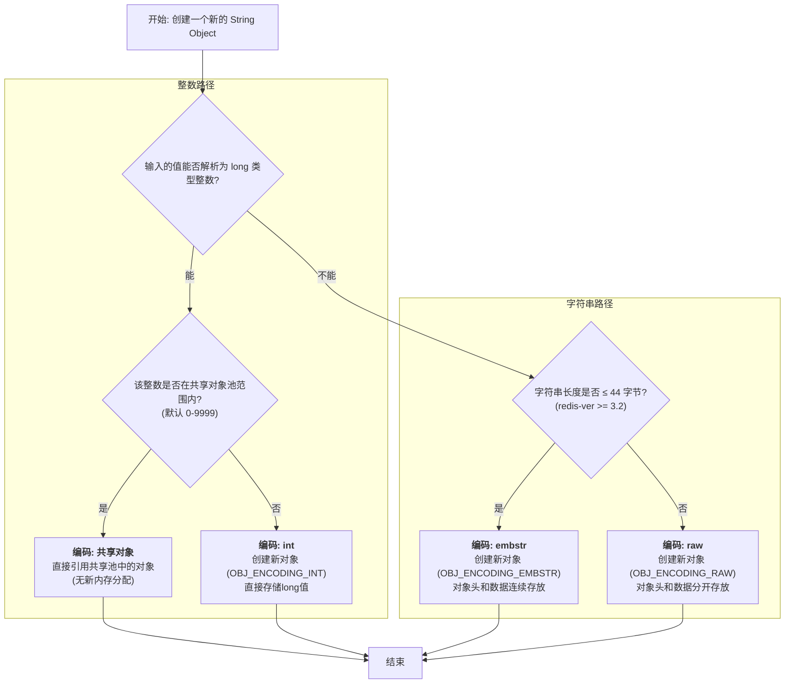

在与 Redis 交互时，`SET mykey "hello"` 似乎是一个简单的字符串赋值操作。然而，为了将性能和内存效率推向极致，Redis 在这看似简单的操作背后，构建了一套精密而复杂的数据结构体系。本文将揭示其三种关键的物理编码——`int`、`embstr` 和 `raw`，并着重探讨 Redis 字符串的SDS。

### 为何需要SDS（简单动态字符串）？

在深入编码之前，我们必须理解 Redis 为何没有直接使用 C 语言原生的 `char*` 字符串，而是自行设计了 SDS (Simple Dynamic String)。

C 语言的字符串以空字符 `\0` 结尾，这种设计在某些场景下存在明显短板：


- **获取长度是 O(N) 操作**：必须从头遍历直到 `\0`。
- **内存分配易出错**：字符串拼接或修改时，需要开发者手动管理内存，极易导致缓冲区溢出。
- **非二进制安全**：无法存储包含 `\0` 的数据，因为 `\0` 会被误判为字符串结尾。

为了克服这些缺陷，Redis 创造了 SDS。**在 Redis 中，所有键（Key）都是由 SDS 实现的，所有值（Value）对象中包含的字符串数据，其底层同样是 SDS。**

SDS 的结构并非单一，为了针对不同长度的字符串进行优化，它定义了多种 `sdshdr` 类型（在 `sds.h` 中）：`sdshdr5`, `sdshdr8`, `sdshdr16`, `sdshdr32`, `sdshdr64`，分别用于存储不同长度级别的内容。以 `sdshdr8` 为例，其核心结构如下：

```c
struct sdshdr8 {
    uint8_t len;     // 已用长度
    uint8_t alloc;   // 总分配长度，不含头和\0
    unsigned char flags; // 3位类型 + 5位未使用
    char buf[];      // 实际数据
};
```


SDS 的优势显而易见：

1. **O(1)时间复杂度获取长度**：`len` 属性直接记录了当前字符串长度。
2. **高效的内存分配策略**：

    - **空间预分配**：当 SDS 增长时，若增长后 `len` 小于 1M，则会额外分配与 `len` 相同大小的未使用空间 (`free`)；若超过 1M，则固定额外分配 1M。这避免了每次修改都进行内存重分配。
    - **惰性空间释放**：当 SDS 缩短时，多余的空间不会立即释放，而是记录在 `free` 字段（`alloc - len`），供后续增长使用，减少了内存的分配和回收开销。
3. **二进制安全**：SDS 通过 `len` 属性判断字符串结束，而非 `\0`，因此可以安全地存储任意二进制数据。

### 统一的封装：RedisObject

Redis 数据库中的每个键值对都是由对象来表示的。其中，`RedisObject` 是所有数据类型的上层封装：

```c
typedef struct redisObject {
    unsigned type:4;       // 对象类型 (String, List, etc.)
    unsigned encoding:4;   // 物理编码 (int, embstr, raw, etc.)
    unsigned lru:24;       // LRU/LFU 数据
    int refcount;          // 引用计数
    void *ptr;             // 指向底层数据结构的指针
} robj;
```

对于字符串类型（`type` 为 `OBJ_STRING`），`encoding` 字段决定了其底层的物理实现。接下来，我们将深入分析这三种编码方式。

### 字符串的三大物理编码方式与源码分析

当我们执行 `set k1 v1` 时，其底层的调用链路大致如下：  
​`setCommand` -> `setGenericCommand` -> ... -> `tryObjectEncoding`​

​`tryObjectEncoding` 函数是决定字符串编码的关键。


#### 1. 编码方式一：`int`​

当一个字符串值可以被解析为一个 64 位有符号长整型（long）时，Redis 会选择 `int` 编码。

- **内存结构**：此时，`RedisObject` 的 `ptr` 指针不再指向一个内存地址，而是**直接存储这个整数值**（通过类型强转）。这极大地节省了一个指针的内存开销。

  ```shell
  127.0.0.1:6379> SET age 25
  OK
  127.0.0.1:6379> OBJECT ENCODING age
  "int"

  # 浮点数会被转为字符串存储
  127.0.0.1:6379> SET pi 3.14
  OK
  127.0.0.1:6379> OBJECT ENCODING pi
  "embstr"
  ```

  
- **共享整数池**：为了进一步节约内存，Redis 在启动时会预先创建 0 到 9999 的共享整数对象。如果设置的值在此范围内，Redis会直接引用这些共享对象，而不是创建新对象。

  ```c
  #define OBJ_SHARED_INTEGERS 10000
  // ...
  if (len <= 20 && string2l(s,len,&value)) { // 长度小于20且能转为long
      if (server.maxmemory == 0 && value >= 0 && value < OBJ_SHARED_INTEGERS) {
          // ...
          return shared.integers[value]; // 返回共享对象
      }
      // ...
  }
  ```

  这意味着，执行 `set k1 123` 和 `set k2 123` 后，`k1` 和 `k2` 的值都指向了同一个共享的 `RedisObject`，这与 Java 的 `String a = "123"; String b = "123";` 的字符串常量池有异曲同工之妙。

  

#### 2. 编码方式二：`embstr` (Embedded String)

当字符串长度**小于等于 44 字节**时，Redis 采用 `embstr` 编码。

- **内存结构**：`embstr` 的核心特点是**一次性连续内存分配**。它将 `RedisObject` 结构体本身和其后的 `sdshdr` 结构体分配在同一块连续的内存中。

  

  我们可以在源码 `createEmbeddedStringObject` 中找到证据：

  ```c
  robj *createEmbeddedStringObject(const char *ptr, size_t len) {
      // 一次性分配 RedisObject 和 sdshdr8 的总空间
      robj *o = zmalloc(sizeof(robj)+sizeof(struct sdshdr8)+len+1);
      struct sdshdr8 *sh = (void*)(o+1); // sdshdr8 紧跟在 robj 后面
      // ...
      o->ptr = sh+1; // ptr 指向 buf
      // ...
      return o;
  }
  ```

  这种布局的好处是，元数据（`RedisObject`）和实际数据（SDS）在内存上是连续的，能更好地利用 CPU 缓存，并且创建和销毁时只需一次内存操作，减少了内存碎片。

#### 3. 编码方式三：`raw`​

当字符串长度**大于 44 字节**时，则使用 `raw` 编码。

- **内存结构**：与 `embstr` 不同，`raw` 编码会进行**两次内存分配**。一次为 `RedisObject` 分配，另一次为 `sdshdr` 分配。`RedisObject` 的 `ptr` 指针指向独立的 `sdshdr` 内存区域。

  

#### 特殊情况：`embstr` 的只读特性与编码转换

Redis 的编码选择并不是一成不变的，它会根据情况发生变化。一个最经典的例子就是对 `embstr` 编码对象的修改。

​`embstr` 编码在设计上是**只读**的。由于其 `RedisObject` 和 SDS 的内存是连续分配的，对它进行修改会非常麻烦。因此，Redis 的策略是：**任何对** **​`embstr`​** **编码对象的修改，都会先将其转换为** **​`raw`​** **编码，然后再执行修改。**

这个例子清晰地证明了这一点：

```shell
127.0.0.1:6379> set k3 a
OK
127.0.0.1:6379> object encoding k3
"embstr"  // 初始为 embstr

127.0.0.1:6379> APPEND k3 b
(integer) 2

127.0.0.1:6379> get k3
"ab"

127.0.0.1:6379> object encoding k3
"raw"    // 修改后，即使长度只有2，也变成了 raw
```

### 编码决策流程

根据源码逻辑，我们可以总结出字符串对象编码的决策流程：

1. **判断是否为整数**：尝试将字符串转换为 long 类型。

    - **成功**：

      - 检查该整数是否在共享整数池范围内 (`[0, 9999]`) 且服务器未设置 `maxmemory` 策略。

        - **是**：直接返回共享整数池中的对象 (`int` 编码)。
        - **否**：创建一个新的 `RedisObject`，`ptr` 直接存储整数值 (`int` 编码)。
    - **失败**：进入下一步。
2. **判断字符串长度**：检查字符串的字节长度。

    - **长度 &lt;= 44 字节**：创建 `embstr` 编码的对象。
    - **长度 &gt; 44 字节**：创建 `raw` 编码的对象。



‍

### 结论

通过对 Redis 字符串内部实现的深入剖析，我们可以得出以下核心结论：

1. ​**​`int`​** **编码**：当值为长整型时使用。`RedisObject` 的 `ptr` 直接存储整数，无需额外指针，并利用共享池机制，实现了极致的内存优化。
2. ​**​`embstr`​** **编码**：当值为小于等于 44 字节的字符串时使用。通过**一次内存分配**，将 `RedisObject` 和 `sdshdr` 存储在连续空间中，提高了缓存命中率，减少了内存碎片。
3. ​**​`raw`​** **编码**：当字符串大于 44 字节，或对 `embstr` 对象进行修改时使用。`RedisObject` 和 `sdshdr` 分别通过**两次内存分配**获得，提供了更高的灵活性。

‍


‍
