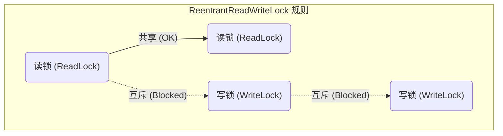

在前面的文章中，我们深入探讨了 `ReentrantLock`​，它是一个功能强大的独占锁。但在很多业务场景中，读操作的频率远远高于写操作。如果此时仍然使用 `ReentrantLock`，即使是多个读线程之间互不影响，它们也必须排队等待，这无疑大大降低了并发性能。

为了解决这个问题，`ReentrantReadWriteLock` 应运而生。

---

#### 1. 什么是 ReentrantReadWriteLock？

​`ReentrantReadWriteLock`​，顾名思义，是一个**可重入的读写锁**。它巧妙地将锁分为了两种类型：**读锁（Read Lock）**  和 **写锁（Write Lock）** 。这两种锁遵循以下核心规则：

- **读读共享**：多个线程可以同时持有读锁，互不影响。
- **写写互斥**：同一时间只允许一个线程持有写锁。
- **读写互斥**：当有线程持有读锁时，写锁必须等待；当有线程持有写锁时，所有读锁都必须等待。

我们可以用一个简单的表格来总结它们的兼容性：

||**当前有读锁**|**当前有写锁**|**无锁**|
| :-| :--------| :--------| :--------|
|**请求读锁**|✅ 成功|❌ 失败|✅ 成功|
|**请求写锁**|❌ 失败|❌ 失败|✅ 成功|

这个规则的核心思想是：**允许多人同时阅读，但只允许一人进行修改，且修改时不能有任何人阅读。**



这种设计使得 `ReentrantReadWriteLock`​ 在“**读多写少**”的场景下，能够发挥出比 `ReentrantLock` 更高的并发性能。

---

#### 2. 核心概念：锁降级 (Lock Downgrading)

锁降级是 `ReentrantReadWriteLock` 中一个非常重要且独特的概念。

**定义**：锁降级指的是，在**同一个线程**中，**先获取写锁，再获取读锁，然后释放写锁**的过程。

##### 那么，锁降级的好处到底是什么？为什么要这么做？

这主要是为了保证**数据的一致性**和**可见性**。让我们通过一个经典的缓存读写场景 (`CachedData`) 来深入理解。

##### 2.1 案例分析：`CachedData` 的实现

假设我们有一个缓存系统，需要在使用缓存前检查其是否有效。如果无效，则需要更新缓存，然后使用它。

```java
class CachedData {
    Object data;
    // 使用 volatile 保证 cacheValid 在多线程间的可见性
    volatile boolean cacheValid;
    final ReentrantReadWriteLock rwl = new ReentrantReadWriteLock();

    void processCachedData() {
        // 1. 获取读锁，准备读取缓存状态
        rwl.readLock().lock();
        if (!cacheValid) {
            // 缓存无效，必须获取写锁来更新
            // 2. 必须先释放读锁，才能获取写锁（因为读写互斥）
            rwl.readLock().unlock();
            rwl.writeLock().lock();
            try {
                // 3. 双重检查：因为在释放读锁到获取写锁的间隙，
                //    可能有其他线程已经更新了缓存。
                if (!cacheValid) {
                    // data = ... 更新数据
                    cacheValid = true;
                }
                // 4.【锁降级关键步骤】在释放写锁之前，获取读锁
                //    这保证了当前线程在读取数据期间，数据不会被其他写线程再次修改
                rwl.readLock().lock();
            } finally {
                // 5. 释放写锁，但仍然持有读锁
                rwl.writeLock().unlock(); 
            }
        }

        try {
            // 6. 使用数据 (此时线程持有读锁，数据是安全且一致的)
            // use(data);
        } finally {
            // 7. 释放最后的读锁
            rwl.readLock().unlock();
        }
    }
}
```

##### 2.2 深入剖析锁降级的必要性

让我们来做个“头脑风暴”，如果没有第 4 步的锁降级会发生什么？

**场景：违背锁降级步骤**

1. **线程 A** 调用 `processCachedData()`​，发现 `cacheValid`​ 为 `false`。
2. 线程 A 释放读锁，获取写锁，成功更新了数据 (`data`​) 和状态 (`cacheValid = true`)。
3. **关键点**：线程 A **直接释放了写锁**，没有预先获取读锁。
4. 就在线程 A 准备去获取读锁来使用 `data`​ 的**微小间隙**里，**线程 B** 冲了进来，它也想更新缓存。
5. 线程 B 成功获取了**写锁**，并修改了 `data`​ 为一个**新的值**。
6. 线程 A 此时终于获取到了读锁，它开始使用 `data`​，但它读到的却是被线程 B 修改后的**脏数据**，而不是自己刚刚写入的那个版本！这就造成了数据不一致。

**结论：遵循锁降级步骤**

通过在释放写锁前先获取读锁，线程 A 保证了从它更新数据到使用数据这个过程的**原子性**。当线程 A 持有读锁时，任何其他企图获取写锁的线程（如线程 B）都会被阻塞，直到线程 A 完成数据处理并最终释放读锁。

> **一句话总结**：锁降级的目的，是保证在释放写锁后、到读操作完成前的这段时间里，数据不会被其他线程修改，从而确保当前线程能读到自己写入的最新、最一致的数据。

---

#### 3. 为什么锁不能“升级”？

既然可以从写锁“降级”为读锁，那是否可以反过来，从读锁“升级”为写锁呢？答案是**不允许**。

**原因：防止死锁。**

试想一下，如果允许多个线程进行锁升级：

- 线程 A 和线程 B 都成功获取了**读锁**。
- 接着，线程 A 想要获取**写锁**，它必须等待其他所有线程（包括线程 B）释放读锁。
- 与此同时，线程 B 也想获取**写锁**，它也必须等待其他所有线程（包括线程 A）释放读锁。

此时，A 在等 B 释放锁，B 也在等 A 释放锁，双方都持有对方需要的资源，同时又在等待对方释放资源，从而陷入了**永久的等待**，也就是**死锁**。因此，`ReentrantReadWriteLock` 的设计者从根本上禁止了锁升级的可能性。


---

#### 4. ReentrantReadWriteLock 的局限性：写锁饥饿与悲观读取

尽管 `ReentrantReadWriteLock` 优化了读多写少的场景，但它并非完美无缺。

1. **写锁饥饿问题**：  
    如果读锁的请求非常密集，源源不断地有线程来获取读锁。那么写线程可能会一直等待，永远无法获得获取写锁的机会，导致“饥饿”。（虽然可以通过创建公平锁来缓解，但这会牺牲一部分性能）。
2. **悲观的读锁策略**：  
    ​`ReentrantReadWriteLock`​ 的读锁是一种**悲观锁**。一旦有任何线程持有读锁，写线程就必须被阻塞。它认为“只要有人在读，你就不能写”，以防止数据在读取过程中被修改。

    > **读锁结束，写锁有望；写锁独占，读写全堵。**
    >

这种悲观策略虽然保证了强一致性，但在某些追求极致性能的场景下，可能显得过于保守。
