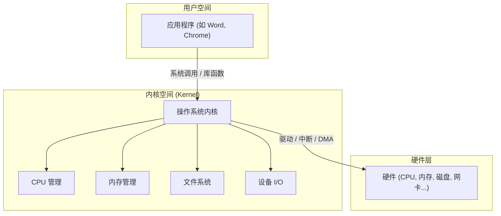

我们每天都在使用电脑和手机，运行着各式各样的应用程序。但你是否想过，这些程序是如何与冰冷的硬件（CPU、内存、硬盘）协同工作的？这背后，离不开一个沉默而强大的功臣——**操作系统（Operating System, OS）** 。

---

#### 1. 引入：如果没有操作系统，世界会怎样？

想象一下，如果你是一名应用开发者，但世界上没有 Windows、macOS、Linux 或 Android，会发生什么？

- **你必须直接操控硬件**：你的代码里不仅要包含业务逻辑，还必须写满与 CPU 寄存器、内存地址、磁盘扇区、网卡端口直接交互的指令。
- **开发成本极高**：你需要为市面上每一种显卡、声卡、主板编写不同的驱动代码，这既繁琐又极易出错。
- **没有并发**：你的音乐播放器在运行时，你的代码编辑器就必须完全停止，因为没有一个“协调者”来管理 CPU 时间。

这显然是一场灾难。遵循软件工程的黄金法则—— **“加一个中间层解决所有问题”** ——操作系统应运而生。

操作系统在**应用程序**和**硬件**之间建立了一道屏障，它既是服务员，又是大管家。

---

#### 2. 操作系统的两大核心角色

我们可以从两个视角来理解操作系统的核心职责。

##### 2.1 对上：为应用程序提供服务的“全能接口”

操作系统将复杂丑陋的硬件细节**抽象**成了简单易用的服务接口。应用程序不再需要关心底层硬件的差异，只需调用操作系统提供的 API（即**系统调用**）即可。

- **文件系统**：你只需调用 `open("file.txt")`，而无需关心文件具体存储在磁盘的哪个磁道、哪个扇区。
- **进程管理**：你只需 `fork()`​ 或 `create_process()`，操作系统会帮你处理内存分配、CPU 时间调度等所有细节。
- **网络通信**：你只需 `send()` 数据包，操作系统会负责打包、路由和网卡驱动的调用。

**结果**：应用程序的开发变得**更简单、更统一、更具可移植性**。

##### 2.2 对下：管理硬件资源的“大管家”

计算机的资源（CPU、内存、磁盘等）是有限的。当多个程序同时运行时，如何**公平、高效、安全**地分配这些资源，就是操作系统的第二个核心职责。

- **目标**：

  - 让多个程序**公平共享**与**高效使用**硬件。
  - 保证程序之间**安全隔离**，互不干扰。
  - 在有限资源下，尽量提高系统的**吞吐量**和**响应速度**。

---

#### 3. 操作系统如何解决三大核心矛盾？

##### 3.1 CPU 只有一个，如何实现“万物并行”？

**矛盾**：物理上，一个 CPU 核心在同一时刻只能执行一条指令，但我们却感觉可以同时聊微信、听音乐、写代码。

**OS 的解决方案：调度 (Scheduling)**   
操作系统通过极快的速度在不同进程/线程之间切换 CPU 的使用权（称为**上下文切换**）。每个程序只运行一个极短的时间片（例如 10 毫秒），然后立刻切换到下一个。由于切换速度远超人类感知，宏观上就营造出了所有程序“同时运行”的假象——即**并发**。

##### 3.2 内存有限，如何做到“既够用又安全”？

**矛盾**：物理内存有限，且程序 A 不应该能访问到程序 B 的数据，以免造成崩溃或安全问题。

**OS 的解决方案：虚拟内存 (Virtual Memory)**

1. **隔离与保护**：操作系统为每个进程分配一个独立的、私有的**虚拟地址空间**。进程看到的内存地址都不是真实的物理地址。当进程访问内存时，由硬件（MMU）和操作系统共同将虚拟地址翻译成物理地址，并检查访问是否越界。
2. **扩充空间**：当物理内存不足时，操作系统会将一部分暂时不用的内存数据，换出到磁盘上（Swap）。当需要时再换回内存。这使得程序感觉自己拥有的内存远大于实际的物理内存。

##### 3.3 I/O 设备五花八门，如何实现“统一管理”？

**矛盾**：市面上有成千上万种不同厂商、不同接口的硬盘、网卡、鼠标，应用程序如何与它们统一交互？

**OS 的解决方案：驱动程序与文件系统**

1. **驱动程序 (Driver)** ：由设备厂商或操作系统开发者编写的、专门用于与特定硬件通信的“翻译官”。
2. **统一接口**：操作系统在所有驱动程序之上，提供了一层统一的抽象接口，比如将所有存储设备都抽象为“文件”和“目录”的形式，即**文件系统**。

---

#### 4. “壳”与“核”：你所见的并非操作系统的一切

我们日常接触的 Windows 桌面、命令行窗口（Shell），都只是操作系统的**外壳**，它们是提供给用户的交互界面。而操作系统真正的核心，是运行在硬件之上的**内核（Kernel）** 。

内核运行在最高权限的**特权态**，拥有对所有硬件的完全控制权。它主要由四大核心模块构成：

- **CPU 管理**：负责进程/线程的创建、销毁、调度、同步与通信。
- **内存管理**：负责虚拟内存、内存分配与回收、页缓存等。
- **存储/文件系统**：负责文件和目录的管理、权限控制、数据缓存等。
- **设备 I/O 管理**：负责中断处理、驱动框架、网络/磁盘等设备的访问。

我们后续的学习，也将围绕这四大模块逐一展开。

---

#### 5. 一图总览：操作系统在计算机体系中的位置

最后，让我们用一张图来总结应用程序、操作系统内核与硬件之间的关系。

**图解**：应用程序运行在**用户空间**，通过**系统调用**向内核请求服务。内核运行在**内核空间**，作为资源的唯一管理者，通过**驱动程序**和**中断**等机制与底层**硬件**交互，完成应用程序的请求。

‍
